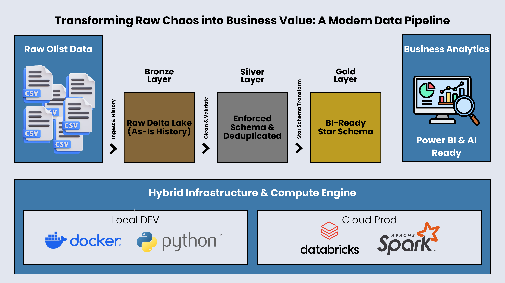

# Olist E-commerce Lakehouse: End-to-End Data Platform

## Resumo do Projeto
> *Note for Recruiters: This project documentation is primarily in English to demonstrate technical proficiency, but a portuguese summary is provided below.*

> *Nota aos Recrutadores: A documentação desse projeto estará principalmente em Inglês, com fins de mostrar proficiência Técnica e Linguistica, mas um resumo em português estará disponível abaixo.*
---

## Este projeto simula um ambiente real de Engenharia de Dados utilizando o [**dataset de E-commerce brasileiro da Olist**](https://www.kaggle.com/olistbr/brazilian-ecommerce).

**O que eu fiz:**
* Construí um **Data Lakehouse** completo (Bronze, Silver, Gold).
* Utilizei **Python (PySpark)** e **Delta Lake** para garantir qualidade de dados.
* Modelei os dados em **Star Schema** para facilitar dashboards no Power BI.
* O projeto roda tanto localmente com **Docker** quanto na nuvem com **Databricks**.

**Tecnologias:** Python, Spark, SQL, Docker, Databricks.

---

## 📋 Project Overview (English)


## 📋 Project Overview
This project is a modern **Data Lakehouse** implementation built to analyze the [Brazilian E-Commerce Public Dataset by Olist](https://www.kaggle.com/olistbr/brazilian-ecommerce).

It transforms raw CSV logs into a production-ready **Star Schema** optimized for high-performance analytics and AI/RAG applications. The pipeline follows the **Medallion Architecture** (Bronze → Silver → Gold) to ensure data quality, lineage, and scalability.

**Key Goals:**
* **Engineering:** Build a robust ETL pipeline using **PySpark** and **Delta Lake**.
* **Analytics:** Create a **Star Schema** (Facts & Dimensions) for Power BI/Tableau.
* **Data Quality:** Implement automated schema enforcement and deduplication.
* **Hybrid Deployment:** Designed to run locally (Docker) and in the cloud (**Databricks**).

---

## 🏗️ Architecture

The pipeline processes data through three standardized layers:

| Layer | Type | Format | Description |
| :--- | :--- | :--- | :--- |
| **Bronze** | Raw Ingestion | Delta | Raw data ingested from CSVs with schema inference. Acts as a historic safety net. |
| **Silver** | Cleaned & Enriched | Delta | **Strict Schema Enforcement**. Data is deduplicated, types are cast (String → Timestamp/Float), and nulls are handled. |
| **Gold** | Business Aggregates | Delta | **Star Schema** model. Joins tables into **Facts** (Transactions, Reviews) and **Dimensions** (Customers, Products) for easy reporting. |

<div align="center">
  
</div>

---

## 🛠️ Tech Stack & Key Features

* **Compute:** Apache Spark (PySpark)
* **Storage:** Delta Lake (ACID Transactions, Time Travel)
* **Orchestration:** Docker & Python Scripts
* **Environment:** Hybrid (Local Docker + Databricks Community Edition)

### 🌟 Engineering Highlights
* **Metadata-Driven Ingestion:** The Silver layer uses a configuration-based approach (`config/schemas.py`) to process 9+ tables with a single generic loop, reducing code duplication by 80%.
* **Quality Gates:** Custom utility functions enforce data types (trimming strings, parsing dates) before data enters the Silver layer.
* **Idempotency:** All jobs are designed to be re-runnable (`overwrite` mode) without creating duplicates.
* **Star Schema Modeling:** Gold layer transforms normalized data (3NF) into a denormalized model (`fact_sales`, `dim_customers`) optimized for BI tools.

---

## 📂 Project Structure

```bash
olist-ecommerce-lakehouse/
├── config/
│   ├── paths.py             # Logic to switch between Local (Docker) and Cloud (DBFS) paths
│   ├── schemas_silver.py    # Strict StructTypes for Silver Layer
│   └── spark_settings.py    # Centralized SparkSession builder with Delta support
├── notebooks/
│   ├── 01_ingest_bronze.py  # Raw CSV -> Bronze Delta
│   ├── 02_transform_silver.py # Cleaning Framework (Deduplication + Type Casting)
│   ├── 03_transform_gold.py   # Business Logic & Star Schema Creation
│   ├── utils.py             # Helper functions for data cleaning
│   └── check_silver.py      # Automated data quality audit script
├── data/                    # Local storage for Lakehouse (Git Ignored)
│   └──raw/                  # Extract the zip file from the kraggle dataset and place all csv's here
├── docker-compose.yml       # Container orchestration for Spark Master/Worker
├── requirements.txt         # Python dependencies
└── README.md                # You're here
````

# How to Run

## Option A: Run Locally (Docker)
Start the Cluster:

```bash
docker-compose up -d
```

## Run the Pipeline:
```Bash
# Step 1: Ingest Raw Data
docker-compose exec spark-master python notebooks/01_ingest_bronze.py

# Step 2: Clean & Deduplicate
docker-compose exec spark-master python notebooks/02_transform_silver.py

# Step 3: Build Star Schema
docker-compose exec spark-master python notebooks/03_transform_gold.py

```

## Option B: Run on Databricks

    Import this repository using Databricks Repos.

    Upload the raw Olist CSVs to dbfs:/FileStore/tables/olist.

    The config/paths.py file will automatically detect the Databricks environment and switch storage paths to DBFS.

    Run the notebooks directly in the workspace.

# Sample Insights (Gold Layer)

## Fact Sales (fact_sales)

* **Grain:** One row per order item.

* **Metrics:** price, freight_value, delivery_days (Calculated: Delivered - Purchase).

* **Keys:** customer_id, product_id, seller_id.

## Dim Products (dim_products)

* **Enriched** with English Category Names (joined from translation table).

# Contact
Maicon Maciel

[LinkedIn](https://linkedin.com/in/MaiconMaciel) | [Portfolio](https://github.com/MaiconMaciel)

